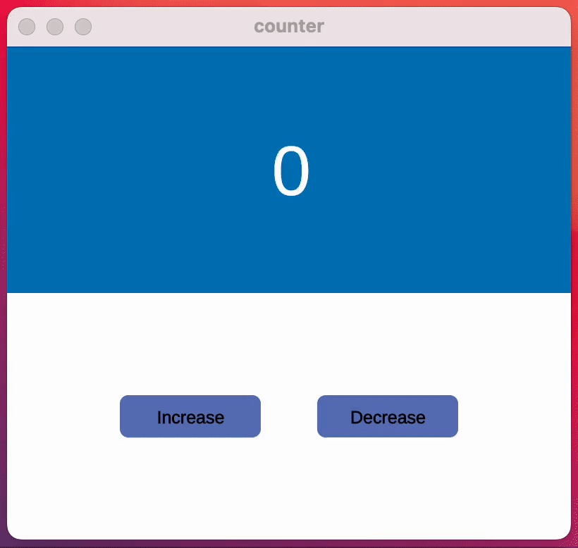
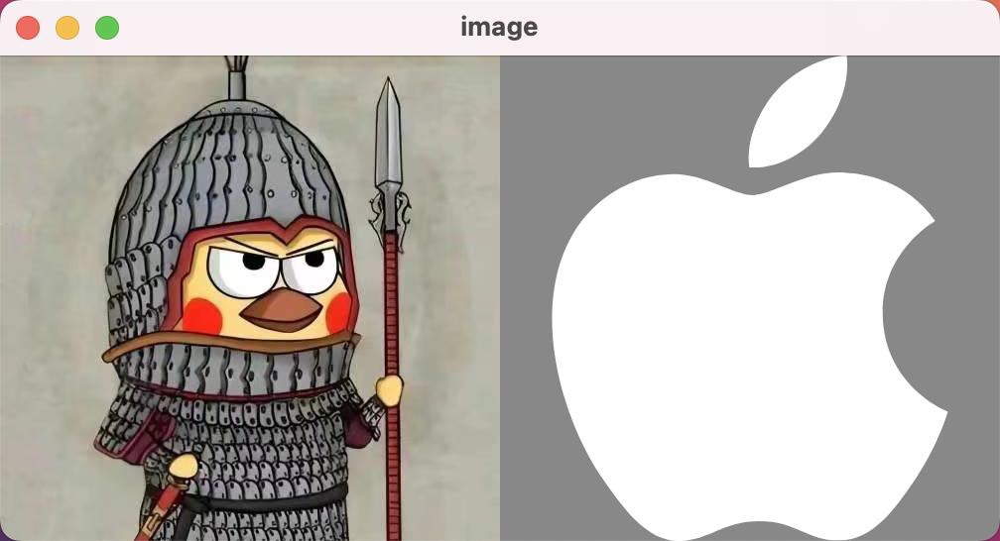
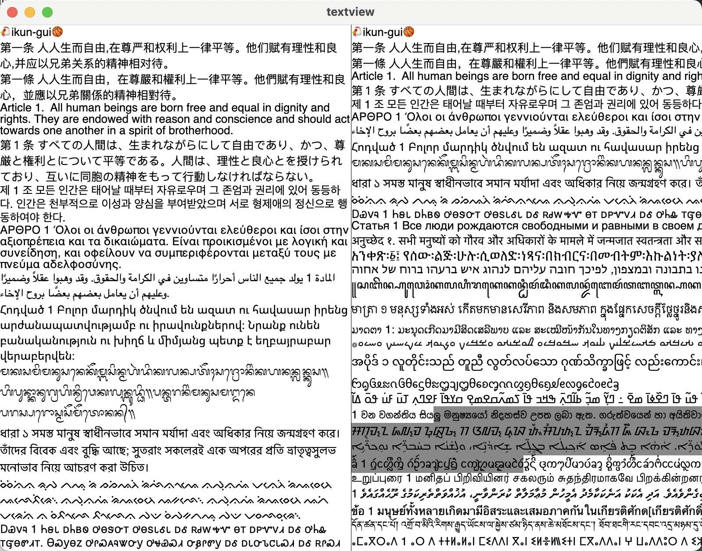

# ikun-gui

🐔**ikun-gui**🏀 is a portable, performant, reactivity and ergonomic framework for building cross-platform gui
applications

## Features 🐔

- [x] 响应式
- [x] 内置组件
  - Button
  - Image
  - Label
  - TextView
- [ ] 热重载
- [ ] 调试工具
- [ ] UI编辑器

## Goals 🏀

* 可移植：支持常见平台、也可移植到嵌入式设备
* 响应式：支持响应式设计
* 高性能和低内存占用

## Examples

* [examples/counter.cpp](examples/counter.cpp)

```cpp
#include "ikun_gui.h"

using namespace ikun_gui_app;
using namespace ikun_gui;

static std::shared_ptr<VNode> app_component(VNode* parent) {
  auto counter = hook::use_signal<int>([] {
    return 0;
  });
  fmt::println("app_component: parent: {}, count: {}", (void*)parent, *counter);

  {
    auto top = VNode::create();
    parent->add_child(top);
    top->attrs.height.percent(50);
    top->attrs.width.percent(100);
    top->attrs.color.rgb(0, 119, 182);
    top->attrs.justify(YGJustifyCenter);
    top->attrs.align.items(YGAlignCenter);
    top->init_attrs();
    {
      auto label = Label::create();
      top->add_child(label);
      label->font_size = 100;
      label->color.white();
      label->text = std::to_string(counter);
      label->init_attrs();
    }
  }

  if (*counter > 0) {
    auto group = VNode::create();
    parent->add_child(group);
    group->attrs.position(YGPositionTypeAbsolute);
    group->attrs.width.percent(100);
    group->attrs.height.px(50);
    group->attrs.align.items(YGAlignCenter);
    group->attrs.justify(YGJustifySpaceAround);
    group->attrs.flex_direction(YGFlexDirectionRow);
    group->init_attrs();

    for (int i = 0; i < *counter; i++) {
      auto node = VNode::create();
      group->add_child(node);
      node->attrs.height.px(50);
      node->attrs.width.px(50);
      node->attrs.color.white();
      node->init_attrs();
    }
  }

  {
    auto bottom = VNode::create();
    parent->add_child(bottom);
    bottom->attrs.height.percent(50);
    bottom->attrs.width.percent(100);
    bottom->attrs.color.white();
    bottom->attrs.justify(YGJustifyCenter);
    bottom->attrs.align.items(YGAlignCenter);
    bottom->attrs.flex_direction(YGFlexDirectionRow);
    bottom->init_attrs();

    // button: +
    {
      auto button = Button::create();
      bottom->add_child(button);
      button->attrs.width.px(200);
      button->attrs.height.px(60);
      button->attrs.color.rgb(100, 119, 182);
      button->init_attrs();
      button->on_click = [counter]() mutable {
        fmt::println("on_click: +");
        counter++;
      };
      {
        auto label = Label::create();
        button->add_child(label);
        label->font_size = 25;
        label->color.black();
        label->bold = true;
        label->text = "Increase";
        label->init_attrs();
      }
    }

    // span
    {
      auto span = VNode::create();
      bottom->add_child(span);
      span->attrs.width.percent(10);
      span->attrs.height.percent(0);
      span->init_attrs();
    }

    // button: -
    {
      auto button = Button::create();
      bottom->add_child(button);
      button->attrs.width.px(200);
      button->attrs.height.px(60);
      button->attrs.color.rgb(100, 119, 182);
      button->init_attrs();
      button->on_click = [counter]() mutable {
        fmt::println("on_click: -");
        counter--;
      };
      {
        auto label = Label::create();
        button->add_child(label);
        label->font_size = 25;
        label->color.black();
        label->bold = true;
        label->text = "Decrease";
        label->init_attrs();
      }
    }
  }
  return nullptr;
}

int main(int argc, char* argv[]) {
  auto app = App::create();
  app->width = 400;
  app->height = 350;
  app->title = "counter";
  app->add_component(app_component);
  return ikun_gui::run(argc, argv, app);
}
```


* [examples/image.cpp](examples/image.cpp)

```cpp
#include "ikun_gui.h"

using namespace ikun_gui_app;
using namespace ikun_gui;

static void app_component(VNode* parent) {
  parent->attrs.flex_direction(YGFlexDirectionRow);
  parent->init_attrs();

  // ikun.jpeg
  {
    auto image = Image::create();
    image->attrs.width.percent(50);
    image->attrs.height.percent(100);
    image->file_path = "img/ikun.jpeg";
    image->init_attrs();
    parent->add_child(image);
  }

  // apple.svg
  {
    auto image = Image::create();
    image->attrs.width.percent(50);
    image->attrs.height.percent(100);
    image->attrs.color.gray();
    image->file_path = "img/apple.svg";
    image->init_attrs();
    parent->add_child(image);
  }
}

int main(int argc, char* argv[]) {
  auto app = App::create();
  app->width = 504;
  app->height = 490 / 2;
  app->title = "image";
  app->add_component(app_component);
  return ikun_gui::run(argc, argv, app);
}
```



* [examples/textview.cpp](examples/textview.cpp)

```cpp
#include "ikun_gui.h"

using namespace ikun_gui_app;
using namespace ikun_gui;

static void app_component(VNode* parent) {
  parent->attrs.flex_direction(YGFlexDirectionRow);
  parent->init_attrs();
  {
    auto tv = TextView::create();
    tv->attrs.width.percent(50);
    tv->attrs.height.percent(100);
    tv->text_file = "text/test.txt";
    tv->init_attrs();
    parent->add_child(tv);
  }
  {
    auto span = VNode::create();
    span->attrs.width.px(1);
    span->attrs.height.percent(100);
    span->init_attrs();
    parent->add_child(span);
  }
  {
    auto tv = TextView::create();
    tv->attrs.width.percent(50);
    tv->attrs.height.percent(100);
    tv->text_file = "text/test.txt";
    tv->line_wrap = false;
    tv->init_attrs();
    parent->add_child(tv);
  }
}

int main(int argc, char* argv[]) {
  auto app = App::create();
  app->width = 800;
  app->height = 600;
  app->title = "textview";
  app->add_component(app_component);
  return ikun_gui::run(argc, argv, app);
}
```



## Roadmap

* 两年半发布一个大版本更新

## License

### 学习研究

```text
MIT License

Copyright (c) 2024 liushuai

Permission is hereby granted, free of charge, to any person obtaining a copy
of this software and associated documentation files (the "Software"), to deal
in the Software without restriction, including without limitation the rights
to use, copy, modify, merge, publish, distribute, sublicense, and/or sell
copies of the Software, and to permit persons to whom the Software is
furnished to do so, subject to the following conditions:

The above copyright notice and this permission notice shall be included in all
copies or substantial portions of the Software.

THE SOFTWARE IS PROVIDED "AS IS", WITHOUT WARRANTY OF ANY KIND, EXPRESS OR
IMPLIED, INCLUDING BUT NOT LIMITED TO THE WARRANTIES OF MERCHANTABILITY,
FITNESS FOR A PARTICULAR PURPOSE AND NONINFRINGEMENT. IN NO EVENT SHALL THE
AUTHORS OR COPYRIGHT HOLDERS BE LIABLE FOR ANY CLAIM, DAMAGES OR OTHER
LIABILITY, WHETHER IN AN ACTION OF CONTRACT, TORT OR OTHERWISE, ARISING FROM,
OUT OF OR IN CONNECTION WITH THE SOFTWARE OR THE USE OR OTHER DEALINGS IN THE
SOFTWARE.
```
